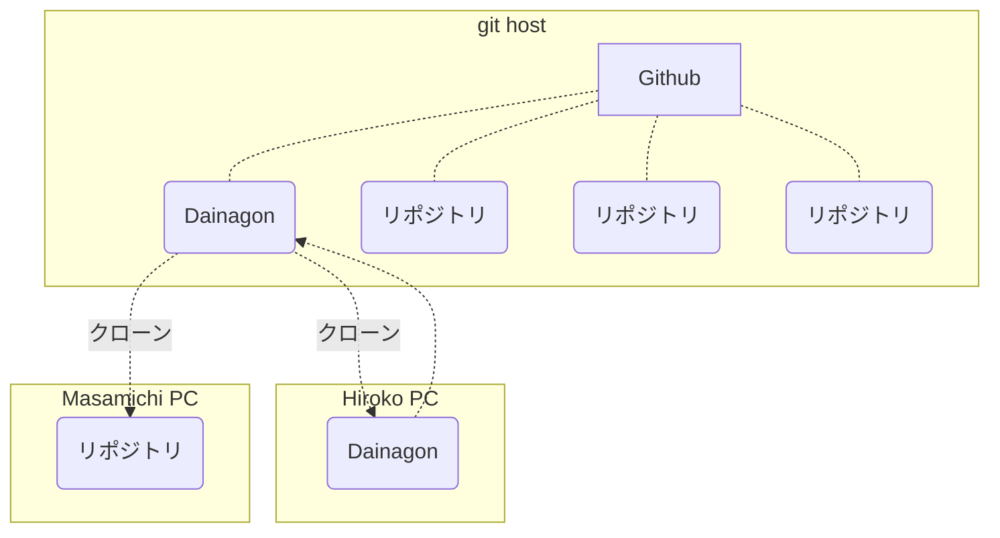

# 200830

- markdown
  - markup language マークアップ言語 Githubなど、色々な場所
  - https://qiita.com/kamorits/items/6f342da395ad57468ae3
  - バッククォートはの@キー => シンタックスハイライト
- LastPass
  - パスワードマネージャー
- Githubクローン
  - Github <= 登録済み
  - GitLab
  - Bitbucket




- git ... バージョン管理システム
  - みんなで作ったプログラムをシェアする場所
  - 変更(バージョン)履歴が全部わかる diff (ディフ)

- ターミナル
  - Bash ... Linux っぽいターミナル
    - シェルスクリプト
      - Shell, bash, csh, zsh...
      - Windowsでも使える
    - コマンド
      - `ls` ... 今いるディレクトリにあるファイルの表示
      - `cd` ... 移動
  - CMD ... Windowsのターミナル


```shell
git config --global 

git status  // 赤は未追加のファイル
git add . // 配下を全て追加
git add README.md
git status // 緑は追加済み
git commit -m "first commit" // セーブ
git push origin master

```

